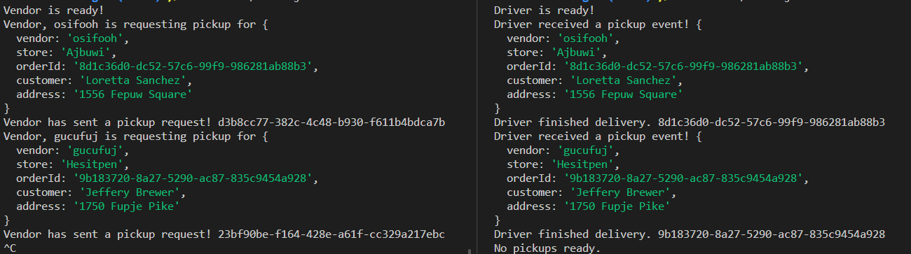

# Lab 19: AWS Events
Integrate CAPS in the cloud using SQS, SNS, and a client app. 

## Feature Tasks & Requirements
A real-time service that allows for vendors, such as flower shops or restaurants, to alert a system of a package needing to be delivered, for drivers to instantly see what’s in their pickup queue, and then to alert the vendors as to the state of the deliveries (in transit, and then delivered).

## Required Services
- SNS Topic (FIFO): pickup which will receive all pickup requests from vendors.
- SQS Queue (FIFO): packages which will contain all delivery requests from vendors, in order of receipt.
- Subscribe this queue to the pickup topic so all pickups are ordered.
- SQS Queue (Standard) for each vendor (named for the vendor) which will contain all delivery notifications from the drivers.

## Operations
- Vendors will post “pickup” messages containing delivery information into the SNS pickup topic.
- Pickup requests should be moved into a SQS FIFO Queue called packages for the drivers automatically.
(Make the packages queue a subscriber to the pickup topic).
- Vendors should separately subscribe to their personal SQS Standard Queue and periodically poll the queue to see delivery notifications.
- Drivers will poll the SQS packages queue and retrieve the delivery orders (messages) in order.
- After a time (e.g. 5 seconds), drivers will post a message to the Vendor specific SQS Standard Queue using the queueUrl specified in the order object.

